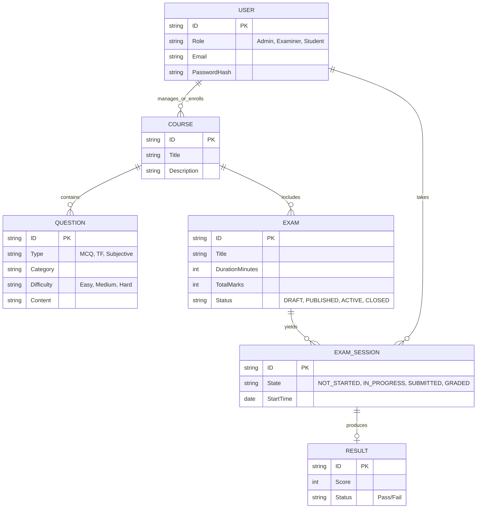

# ER Diagram

```mermaid
erDiagram
    USER {
        string ID PK
        string Role "Admin, Examiner, Student"
        string Email
        string PasswordHash
    }

    COURSE {
        string ID PK
        string Title
        string Description
    }

    QUESTION {
        string ID PK
        string Type "MCQ, TF, Subjective"
        string Category
        string Difficulty "Easy, Medium, Hard"
        string Content
    }

    EXAM {
        string ID PK
        string Title
        int DurationMinutes
        int TotalMarks
        string Status "DRAFT, PUBLISHED, ACTIVE, CLOSED"
    }

    EXAM_SESSION {
        string ID PK
        string State "NOT_STARTED, IN_PROGRESS, SUBMITTED, GRADED"
        date StartTime
    }

    RESULT {
        string ID PK
        int Score
        string Status "Pass/Fail"
    }

    USER ||--o{ COURSE : manages_or_enrolls
    COURSE ||--o{ QUESTION : contains
    COURSE ||--o{ EXAM : includes
    USER ||--o{ EXAM_SESSION : takes
    EXAM ||--o{ EXAM_SESSION : yields
    EXAM_SESSION ||--o| RESULT : produces
```
