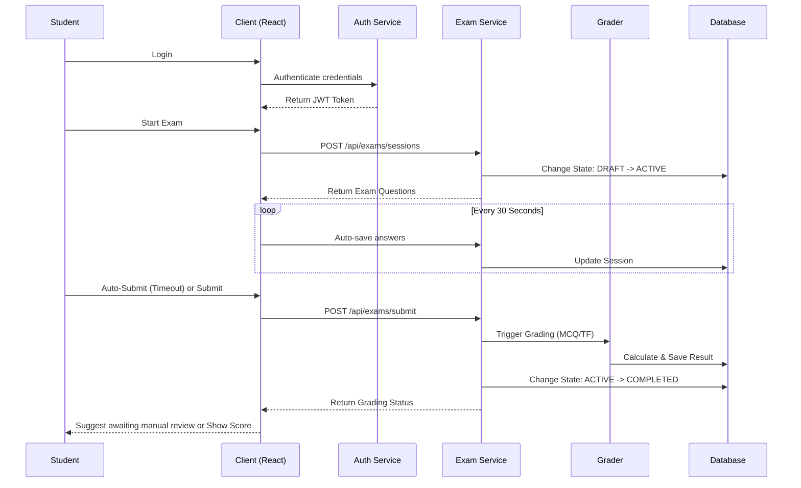

# Sequence Diagram

```mermaid
sequenceDiagram
    participant S as Student
    participant C as Client (React)
    participant A as Auth Service
    participant E as Exam Service
    participant G as Grader
    participant DB as Database

    S->>C: Login
    C->>A: Authenticate credentials
    A-->>C: Return JWT Token

    S->>C: Start Exam
    C->>E: POST /api/exams/sessions
    E->>DB: Change State: DRAFT -> ACTIVE
    E-->>C: Return Exam Questions

    loop Every 30 Seconds
        C->>E: Auto-save answers
        E->>DB: Update Session
    end

    S->>C: Auto-Submit (Timeout) or Submit
    C->>E: POST /api/exams/submit
    E->>G: Trigger Grading (MCQ/TF)
    G->>DB: Calculate & Save Result
    E->>DB: Change State: ACTIVE -> COMPLETED
    E-->>C: Return Grading Status
    C-->>S: Suggest awaiting manual review or Show Score
```
